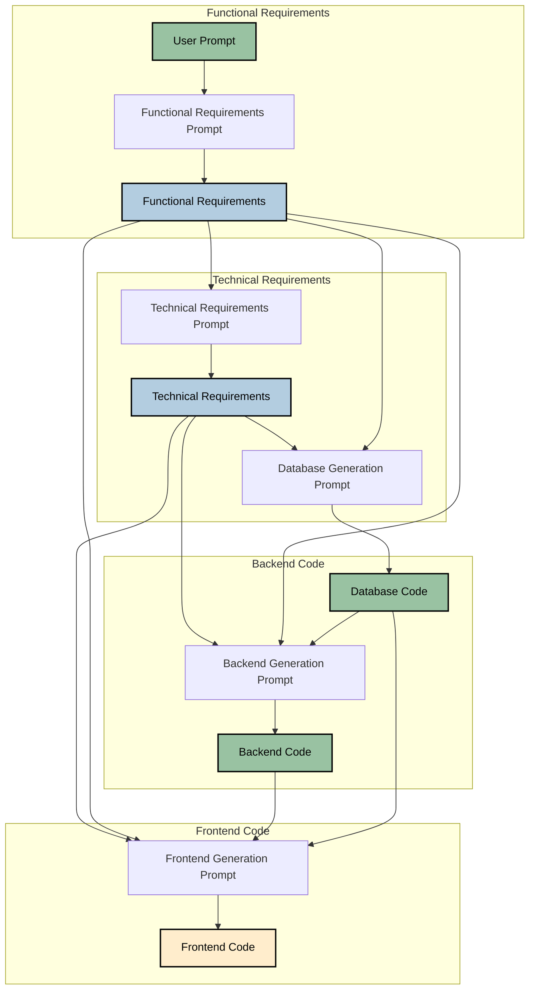

# AI Code Generator CLI v2

A command-line tool that generates complete full stack web applications from a single prompt using AI.

## Purpose

### Problem
 AI models like ChatGPT/Claude/Cursor struggle to create accurate fullstack webapp from scracth. They are not bad at coding but get confused due to following reasons:-
 
- **Models make a lot of assumptions about implementation details which are lost in the black box**
  
  - It assumes details like user flows,screen, technologies etc which are not documented and lost in its decision making process, leading to inaccurate cpde
  - When you prompt the model to build on top of its previous output, it just makes new assumptions leading to inaccuracies across old and new code
  - When you ask it change anything, it doesn't have the relevant context and creates code by filling up the gaps
    
- **As the changes become complex over the chat window it struggles with what to refer to and what not**
  
  - the Code quality drops rapidly as the model needs a lot of hand holding in what past context to take in and what not
  - Changes aren't properly tracked or incorporated across components
  - No clear separation between requirements and implementation

### Solution
We try to solve this problems by dividing the code generation process into distinct steps/phases. We force the AI to document all of its assumptions and details, we also pass the output of previous steps as context to generate the next LLM response. All of this is saved and can be later passed on as context to make further accurate changes.

You just give it a simple prompt like "Create an expense management tool" and it will setup the whole project with relevant code and requirement docs. We explain the chart below on how it takes user prompt and creates the app:


Each phase uses specialized prompts that focus on specific aspects of the application to ensure the best output is generated.\n
We also have different versions of prompt for you to try out and see which leads to highest accuracy code.

### How to make the most of this tool
1. Full code mode: Generates functional requirements doc, technical implementation doc, database setup, backend code and frontend code. It then creates the project files in a folder and installs all the dependencies. You just need to start the backend and frontend server with "npm start"
This folder you then open in an ai code editor like cursor to edit further. The accuracy of code generated by cursor is very high bcause all the assumptions made via ai is present in the folder and cursor has all of that in its context.
2. Code only mode: You can generate the requirements and code in the same folder, but doesnt create the project files and installs the dependencies. 
Then open in an ai code editor like cursor and ask it read all the files, you can then ask it refine the code fill the gaps and create the files for you.
3. Requirements only mode: You can generate the functional requirements and technical implementation details onpen. Open the folder in an ai code editor like cursor and based on the on details ask cursor to create the code.
4. Changing the tech stack: You can edit the prompts to change what tech stack you want for your application, currently all apps are created in react frontend, sqlite for DB and nodejs/express for backend. Prompts can be found in following folder "/ai_code_generator_cli/prompts/"

## We have different approaches using which you can generate accurate output for each phase to test which one works best for you:

### Functional Requirements Phase
| Version | Description | How it Works |
|---------|-------------|--------------|
| v1 | Component-Focused  | Creates detailed requirements with component hierarchies, flowcharts, and UI/UX specifications, focusing on system structure |
| v2 | User Journey-Driven  | Generates narrative-style requirements focusing on user journeys and interactions through the system |
| v3 | Use Case-Driven  | Produces detailed use case descriptions with actors, preconditions, flows, and postconditions |

### Technical Requirements Phase
| Version | Description | How it Works |
|---------|-------------|--------------|
| v1 | Full System Architecture | Generates comprehensive technical specs including system diagrams, data models, and component interactions |
| v2 | API-First Design | Creates technical documentation focusing on API endpoints, data flow, and service interfaces |
| v3 | OpenAPI/Swagger Approach | Produces detailed API specifications in OpenAPI format with schemas, endpoints, and authentication flows |

### Code Generation Phase
| Version | Description | How it Works |
|---------|-------------|--------------|
| v1 | Three-Layer Generation | Separately generates database, API, and frontend code with clear boundaries between layers |
| v2 | Combined Backend Generation | Creates integrated backend (DB + API) first, then generates frontend to match the API |
| v3 | Template-Driven Generation | Uses provided templates to ensure consistent code structure across all components |

This structure allows for 27 different combinations (3x3x3) of approaches across the three phases, each serving a specific purpose in the generation process. Allowing user to pick and choose which combination works the best for their requirements.

NOTE: I am currently testing them all and will release a table highlighting the performace of each version, maybe modify the top ones to get higher accuracy.

## Features

- Multiple prompt versions for requirements and code generation
- Support for both OpenAI and Anthropic models(Currently Claude as an API limit of 1024 tokens so might not be useful)
- Flexible code generation strategies:
  - Combined API (DB + Backend) and Frontend (v1)
  - Separate Database, Backend, and Frontend (v2)
  - Custom Templates (v3), here we can pass code templates to the AI to create accurate code, the templates for backend and frontend are presnet in "/templates" folder
- Rich console output with progress tracking
- Organized project structure with documentation, all files are created in a seperate folder called "/generated_project"

## Installation

1. Clone the repository: 
   ```bash
   git clone https://github.com/vivek100/oneShotCodeGen.git
   cd oneShotCodeGen
   ```

2. Create a virtual environment:
   ```bash
   python -m venv venv
   ```

3. Activate the virtual environment:
   - **Windows**:
     ```bash
     venv\Scripts\activate
     ```
   - **Unix/MacOS**:
     ```bash
     source venv/bin/activate
     ```

4. Install the required packages:
   ```bash
   pip install -r requirements.txt
   pip install -e .
   ```

## Configuration

Create a `.env` file in the root directory with your API keys:
env
OPENAI_API_KEY=your_openai_key
ANTHROPIC_API_KEY=your_anthropic_key


## Usage

The tool provides various options for customization:

- Basic usage with default versions:
  ```bash
  python -m ai_code_generator_cli.cli "Create a todo app"
  ```

- Specify versions for each component:
  ```bash
  python -m ai_code_generator_cli.cli "Create a todo app" \
  --mode full \
  --func-version v2 \
  --tech-version v1 \
  --code-version v3 \
  --backend-template templates/backend.txt \
  --frontend-template templates/frontend.txt
  ```

- Use Anthropic's Claude instead of GPT-4:
  ```bash
  python -m ai_code_generator_cli.cli "Create a todo app" --model anthropic
  ```

- Generate only requirements and code:
  ```bash
  python -m ai_code_generator_cli.cli "Create a todo app" --mode code --func-version v1 --tech-version v1 --code-version v1 
  ```

### Options

- `--mode`: Processing mode
  - `requirements`: Generate only requirements documents
  - `code`: Generate requirements and code (without creating files)
  - `full`: Generate requirements, code, and create project files
- `--func-version`: Version of functional requirements prompt (v1/v2/v3)
- `--tech-version`: Version of technical requirements prompt (v1/v2/v3)
- `--code-version`: Version of code generation prompts (v1/v2/v3)
- `--model`: AI model provider (openai/anthropic)
- `--backend-template`: Path to backend code template file (for v3 only)
- `--frontend-template`: Path to frontend code template file (for v3 only)

## Output Project Structure

All code and llm outputs are saved in generated projects follow a consistent structure:

generated_projects/
└── project_YYYYMMDD_HHMMSS_uniqueid/
├── docs/
│ ├── functional_requirements.md
│ └── technical_requirements.md
├── generatedCode/
│ ├── backend/
│ │ └── output.txt
│ └── frontend/
│ └── output.txt
└── project_summary.md


## Contributing

Contributions are welcome! Please feel free to submit a Pull Request.

## License

This project is licensed under the MIT License - see the LICENSE file for details.

## Note

Make sure to include a `.gitignore` file to prevent sensitive information and unnecessary files from being uploaded to GitHub.
