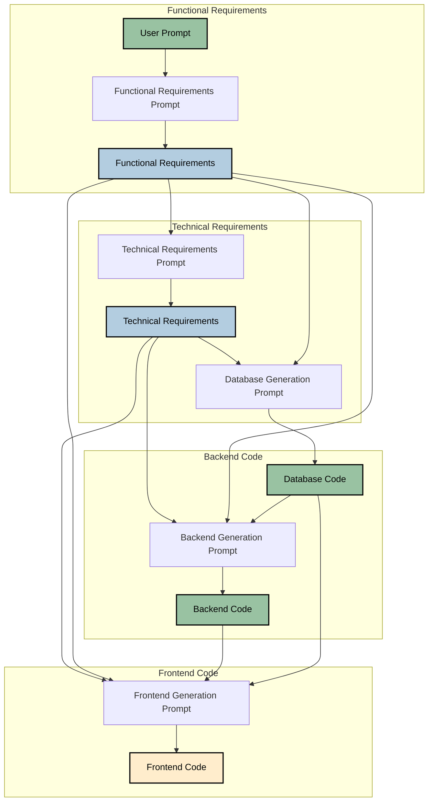

# AI Code Generator CLI v2

A command-line tool that generates complete web applications from natural language descriptions using AI. This version supports multiple prompt versions and flexible code generation strategies.

## Purpose

### Problem
When creating full-stack web applications using AI models like ChatGPT, several challenges arise:
- Models make inconsistent assumptions about implementation details
- Code quality degrades as conversation context grows
- Changes aren't properly tracked or incorporated across components
- No clear separation between requirements and implementation

### Solution
This tool addresses these challenges by breaking down the application generation process into distinct phases, each building upon the previous one:


Each phase uses specialized prompts that focus on specific aspects of the application.
You just ask it "create a todo app" and it will generate the requirements, technical specs, and code for the todo app and save in a folder. 

### How to make the most of this tool
1. Full code mode: The tool generates functional requirements , technical implementation details, database, backend code, and frontend code. Then creates the project files in a folder and installs all the dependencies. 
Which then you can open in an ai code editor like cursor to edit further.Because all the assumptions doen via ai is present in the folder cursor has all all the context and you actually work on minor changes or change the requirements and ask cursor to make the changes.
2. Code only mode: You can generate the requirements and code in the same folder, but doesnt create the project files and installs the dependencies. 
Then open in an ai code editor like cursor and ask it read all the files and refine it and generate the code again.
3. Requirements only mode: You can generate the functional requirements and technical implementation details in a separate folder. Open in an ai code editor like cursor and based on the og requirements or your changes you can ask it to write the code.

##We have three verions of specialized prompts for each phase to test which one works best:

### Functional Requirements Phase
| Version | Description | How it Works |
|---------|-------------|--------------|
| v1 | Component-Focused Analysis | Creates detailed requirements with component hierarchies, flowcharts, and UI/UX specifications, focusing on system structure |
| v2 | User Journey-Driven Analysis | Generates narrative-style requirements focusing on user journeys and interactions through the system |
| v3 | Use Case-Driven Analysis | Produces detailed use case descriptions with actors, preconditions, flows, and postconditions |

### Technical Requirements Phase
| Version | Description | How it Works |
|---------|-------------|--------------|
| v1 | Full System Architecture | Generates comprehensive technical specs including system diagrams, data models, and component interactions |
| v2 | API-First Design | Creates technical documentation focusing on API endpoints, data flow, and service interfaces |
| v3 | OpenAPI/Swagger Approach | Produces detailed API specifications in OpenAPI format with schemas, endpoints, and authentication flows |

### Code Generation Phase
| Version | Description | How it Works |
|---------|-------------|--------------|
| v1 | Three-Layer Generation | Separately generates database, API, and frontend code with clear boundaries between layers |
| v2 | Combined Backend Generation | Creates integrated backend (DB + API) first, then generates frontend to match the API |
| v3 | Template-Driven Generation | Uses provided templates to ensure consistent code structure across all components |

This structure allows for 27 different combinations (3x3x3) of approaches across the three phases, each serving a specific purpose in the generation process.

## Features

- Multiple prompt versions for requirements and code generation
- Support for both OpenAI and Anthropic models
- Flexible code generation strategies:
  - Combined API (DB + Backend) and Frontend (v1)
  - Separate Database, Backend, and Frontend (v2)
  - Custom combinations (v3)
- Rich console output with progress tracking
- Organized project structure with documentation

## Installation

1. Clone the repository: 
   ```bash
   git clone https://github.com/yourusername/ai-code-generator-cli-v2.git
   cd ai-code-generator-cli-v2
   ```

2. Create a virtual environment:
   ```bash
   python -m venv venv
   ```

3. Activate the virtual environment:
   - **Windows**:
     ```bash
     venv\Scripts\activate
     ```
   - **Unix/MacOS**:
     ```bash
     source venv/bin/activate
     ```

4. Install the required packages:
   ```bash
   pip install -r requirements.txt
   pip install -e .
   ```

## Configuration

Create a `.env` file in the root directory with your API keys:
env
OPENAI_API_KEY=your_openai_key
ANTHROPIC_API_KEY=your_anthropic_key


## Usage

The tool provides various options for customization:

- Basic usage with default versions:
  ```bash
  python -m ai_code_generator_cli.cli "Create a todo app"
  ```

- Specify versions for each component:
  ```bash
  python -m ai_code_generator_cli.cli "Create a todo app" \
  --mode full \
  --func-version v2 \
  --tech-version v1 \
  --code-version v3 \
  --backend-template templates/backend.txt \
  --frontend-template templates/frontend.txt
  ```

- Use Anthropic's Claude instead of GPT-4:
  ```bash
  python -m ai_code_generator_cli.cli "Create a todo app" --model anthropic
  ```

- Generate only requirements and code:
  ```bash
  python -m ai_code_generator_cli.cli "Create a todo app" --mode code --func-version v1 --tech-version v1 --code-version v1 
  ```

### Options

- `--mode`: Processing mode
  - `requirements`: Generate only requirements documents
  - `code`: Generate requirements and code (without creating files)
  - `full`: Generate requirements, code, and create project files
- `--func-version`: Version of functional requirements prompt (v1/v2/v3)
- `--tech-version`: Version of technical requirements prompt (v1/v2/v3)
- `--code-version`: Version of code generation prompts (v1/v2/v3)
- `--model`: AI model provider (openai/anthropic)
- `--backend-template`: Path to backend code template file (for v3 only)
- `--frontend-template`: Path to frontend code template file (for v3 only)

## Project Structure

Generated projects follow a consistent structure:

generated_projects/
└── project_YYYYMMDD_HHMMSS_uniqueid/
├── docs/
│ ├── functional_requirements.md
│ └── technical_requirements.md
├── generatedCode/
│ ├── backend/
│ │ └── output.txt
│ └── frontend/
│ └── output.txt
└── project_summary.md


## Contributing

Contributions are welcome! Please feel free to submit a Pull Request.

## License

This project is licensed under the MIT License - see the LICENSE file for details.

## Note

Make sure to include a `.gitignore` file to prevent sensitive information and unnecessary files from being uploaded to GitHub.
